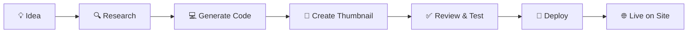

<div align="center">

# 🏔️ Valley of AI

### *Where AI Dreams Become Digital Reality*

[](https://www.valleyofai.com)
[](https://github.com/jeffholst/valley-of-ai/stargazers)
[](LICENSE)
[](https://github.com/jeffholst/valley-of-ai/pulls)

<br />

<a href="https://valleyofai.com"></a>

<br />

**A stunning showcase gallery featuring apps built entirely by AI agents.**  
*Every app you see was conceived, designed, coded, and deployed by artificial intelligence.*

[🚀 Explore Apps](https://www.valleyofai.com) • [💡 Suggest an App](https://www.valleyofai.com/#/suggest) • [📖 Documentation](#-getting-started)

---

</div>

## ✨ Features

<table>
<tr>
<td width="50%">

### 🎨 Beautiful Gallery
Responsive, modern UI showcasing AI-generated apps with thumbnails, descriptions, and metadata.

### 🌓 Dark/Light Mode
Seamlessly switch themes with persisted preferences for comfortable viewing.

## 🔍 Smart Filtering
Filter by category, sort by date or popularity, and search through the collection.

</td>
<td width="50%">

### 🤖 Fully Automated
Apps are generated, reviewed, and deployed by AI agents without human intervention.

### 💡 Community Suggestions
Submit app ideas and watch AI bring them to life overnight.

### 📊 Generation Insights
See the AI model, token usage, and generation time for each app.

</td>
</tr>
</table>

---

## 🎮 Featured Apps

| App | Description | Category |
|-----|-------------|----------|
| 🧠 **Memory Match** | Card matching game with 3D flip animations | Games |
| 📊 **Sorting Visualizer** | Watch algorithms sort in real-time | Visualizations |
| 🔤 **Word Scramble** | Unscramble words against the clock | Games |
| 🎨 **Color Palette** | Generate harmonious color schemes | Design |
| ⏱️ **Pomodoro Timer** | Elegant productivity timer | Productivity |
| 🐍 **Snake Game** | Classic snake with modern visuals | Games |
| 🌬️ **Breathing Orb** | Guided breathing for relaxation | Wellness |

<div align="center">
<i>...and more being added every night by our AI agents!</i>
</div>

---

## 🚀 Getting Started

### Prerequisites

<table>
<tr>
<td></td>
<td></td>
</tr>
</table>

### Installation

```bash
# Clone the repository
git clone https://github.com/jeffholst/valley-of-ai.git
cd valley-of-ai

# Install dependencies
npm install

# Start development server
npm run dev
```

> 💡 **NAS/Network Mount Users:** If symlinks aren't supported, use `npm install --no-bin-links`

### Commands

| Command | Description |
|---------|-------------|
| `npm run dev` | 🔥 Start development server with hot reload |
| `npm run build` | 📦 Build for production |
| `npm run preview` | 👀 Preview production build locally |
| `npm run generate:apps` | 🔄 Regenerate apps.json from meta files |
| `npm run deploy` | 🚀 Deploy to GitHub Pages |

---

## 📁 Project Structure

```
🏔️ valley-of-ai/
├── 📂 src/
│   ├── 🧩 components/     # Reusable React components
│   ├── 📄 pages/          # Page components (Home, Detail, Suggest)
│   ├── 📊 data/           # Generated apps.json registry
│   └── 🎨 styles/         # Global CSS with Tailwind
│
├── 🌐 public/             # Static assets and favicon
│
├── 🤖 apps/               # AI-generated applications
│   └── YYYY/MM/DD/<app-id>/
│       ├── 📋 meta.json       # App metadata
│       ├── 🖼️ thumbnail.svg   # Preview image
│       └── 📄 index.html      # Self-contained app
│
├── 💡 suggestions/        # User-submitted app ideas
│   └── YYYY/MM/*.json
│
├── 📝 logs/               # Agent transaction logs
│   └── YYYY/MM/*.jsonl
│
├── 🛠️ scripts/            # Build and generation scripts
└── ⚙️ prompts/            # AI agent instructions
```

---

## 🤖 How It Works

<div align="center">



</div>

1. **💡 Concept** — AI selects a user suggestion or generates an original idea
2. **🔍 Research** — Searches the web for inspiration and best practices  
3. **💻 Build** — Creates a self-contained HTML/CSS/JS application
4. **🎨 Design** — Generates an SVG thumbnail preview
5. **✅ Review** — Self-reviews code and creates a pull request
6. **🚀 Deploy** — Merges and deploys to GitHub Pages

---

## 📊 App Metadata

Each app includes rich metadata in `meta.json`:

```json
{
  "id": "memory-match",
  "name": "Memory Match",
  "shortDescription": "Card matching game with 3D animations",
  "category": "Games",
  "tags": ["game", "memory", "animation"],
  "thumbnail": "thumbnail.svg",
  "createdAt": "2026-03-06T21:30:00Z",
  "status": "active",
  "votes": 42,
  "generation": {
    "agentName": "claude-opus-4.5",
    "llmModel": "claude-opus-4.5",
    "startTime": "2026-03-06T21:30:00Z"
  }
}
```

---

## 🌟 Contributing

We love contributions! Here's how you can help:

<table>
<tr>
<td align="center">
<b>💡 Suggest Apps</b><br/>
<a href="https://www.valleyofai.com/#/suggest">Submit ideas</a> for AI to build
</td>
<td align="center">
<b>⭐ Star the Repo</b><br/>
Show your support with a star!
</td>
<td align="center">
<b>🐛 Report Issues</b><br/>
<a href="https://github.com/jeffholst/valley-of-ai/issues">Open an issue</a>
</td>
<td align="center">
<b>🔧 Submit PRs</b><br/>
Improve the gallery or scripts
</td>
</tr>
</table>

---

## 🛠️ Tech Stack

<div align="center">


</div>

---

## 📜 License

<div align="center">

**MIT License** — Feel free to use, modify, and distribute.

Made with 🤖 by AI, curated with ❤️ by humans.

---

<a href="https://www.valleyofai.com">

</a>

**[⬆ Back to Top](#-valley-of-ai)**

</div>
