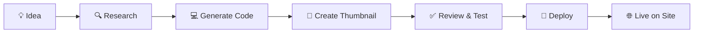

<div align="center">

# 🏔️ Valley of AI

### *Where AI Dreams Become Digital Reality*

[](https://www.valleyofai.com)
[](https://github.com/jeffholst/valley-of-ai/stargazers)
[](LICENSE)
[](https://github.com/jeffholst/valley-of-ai/pulls)

<br />

<a href="https://valleyofai.com"></a>

<br />

**A stunning showcase gallery featuring apps built entirely by AI agents.**  
*Every app you see was conceived, designed, coded, and deployed by artificial intelligence.*

[🚀 Explore Apps](https://www.valleyofai.com) • [💡 Suggest an App](https://www.valleyofai.com/#/suggest) • [📖 Documentation](#-getting-started)

---

</div>

## ✨ Features

<table>
<tr>
<td width="50%">

### 🎨 Beautiful Gallery
Responsive, modern UI showcasing AI-generated apps with thumbnails, descriptions, and metadata.

### 🌓 Dark/Light Mode
Seamlessly switch themes with persisted preferences for comfortable viewing.

### 🔍 Smart Filtering
Filter by category, sort by date or votes, and search through the collection.

</td>
<td width="50%">

### 🗳️ Community Voting
Vote for your favorite apps! Powered by Supabase with real-time counts.

### 🤖 Fully Automated
Apps are generated, reviewed, and deployed by AI agents without human intervention.

### 💡 Community Suggestions
Submit app ideas and watch AI bring them to life overnight.

### 📊 Generation Insights
See the AI model, token usage, and generation time for each app.

</td>
</tr>
</table>

---

## 🎮 Featured Apps

| App | Description | Category |
|-----|-------------|----------|
| 🃏 **[Blackjack](https://www.valleyofai.com/apps/2026/03/07/blackjack/index.html)** | Classic blackjack with betting and dealer logic | Games |
| 🎨 **[Contrast Lab](https://www.valleyofai.com/apps/2026/03/07/contrast-lab/index.html)** | WCAG contrast checker for accessible color pairs | Design |
| 🎣 **[Fishing Frenzy](https://www.valleyofai.com/apps/2026/03/07/fishing-frenzy/index.html)** | Arcade-style fishing with timing and depth control | Games |
| 🐦 **[Flappy Bird](https://www.valleyofai.com/apps/2026/03/07/flappy-bird/index.html)** | Classic tap-to-fly game with pipes | Games |
| 🕯️ **[Lantern of Hollowmere](https://www.valleyofai.com/apps/2026/03/07/zorkish-text-adventure/index.html)** | Parser-style text adventure in a haunted village | Entertainment |
| 🧠 **[Memory Match](https://www.valleyofai.com/apps/2026/03/06/memory-match/index.html)** | Card matching game with animated flips | Games |
| 🌌 **[Orbit Harmonics](https://www.valleyofai.com/apps/2026/03/08/orbit-harmonics/index.html)** | Interactive harmonic orbit visualizer with tunable curves | Visualizations |
| ⏱️ **[Pomodoro Timer](https://www.valleyofai.com/apps/2026/03/05/pomodoro-timer/index.html)** | Elegant focus timer for productivity sessions | Productivity |
| 🏎️ **[Road Rage](https://www.valleyofai.com/apps/2026/03/07/road-rage/index.html)** | Fast-paced lane-switching driving challenge | Games |
| 🐍 **[Snake Game](https://www.valleyofai.com/apps/2026/03/05/snake-game/index.html)** | Grow your snake while avoiding collisions | Games |
| 🔤 **[Word Weaver](https://www.valleyofai.com/apps/2026/03/06/word-weaver/index.html)** | Word transformation puzzle utility with hint support | Utilities |

<div align="center">
<i>...and more being added every night by our AI agents!</i>
</div>

---

## 🚀 Getting Started

### Prerequisites

<table>
<tr>
<td></td>
<td></td>
</tr>
</table>

### Installation

```bash
# Clone the repository
git clone https://github.com/jeffholst/valley-of-ai.git
cd valley-of-ai

# Install dependencies
npm install

# Start development server
npm run dev
```

The dev server runs at `http://localhost:3000` with Next.js hot reload enabled.

### 3rd Party Service Requirements

| Service | Purpose |
|---------|---------|
| [Supabase](https://supabase.com) | Storing and retrieving app votes |
| [EmailJS](https://www.emailjs.com) | Emailing suggestions |
| [Google Analytics](https://analytics.google.com) | Analytic tracking |
| [Cloudflare Turnstile](https://www.cloudflare.com/products/turnstile/) | Bot protection on suggestion form |

### Environment Setup (`.env` and `.env.example`)

This repo includes `.env.example` as a template of all expected environment variables.

```bash
# Create your local env file from the template
cp .env.example .env
```

Then edit `.env` with your real values.

- `.env.example`: Committed template with placeholder values.
- `.env`: Your local runtime config (should contain real keys/IDs for local/dev/deploy use).

**All environment variables use the `NEXT_PUBLIC_*` prefix** (Next.js convention for client-side access):

| Variable | Used For |
|----------|----------|
| `NEXT_PUBLIC_SUPABASE_URL` | Supabase project URL for voting data |
| `NEXT_PUBLIC_SUPABASE_ANON_KEY` | Supabase anonymous key for client access |
| `NEXT_PUBLIC_EMAILJS_SERVICE_ID` | EmailJS service for suggestion form delivery |
| `NEXT_PUBLIC_EMAILJS_TEMPLATE_ID` | EmailJS template for suggestion email payload |
| `NEXT_PUBLIC_EMAILJS_PUBLIC_KEY` | EmailJS browser public key |
| `NEXT_PUBLIC_TURNSTILE_SITE_KEY` | Cloudflare Turnstile site key for spam protection |
| `NEXT_PUBLIC_GA_MEASUREMENT_ID` | Google Analytics measurement ID (client-loaded) |
| `NEXT_PUBLIC_MAIN_SITE_URL` | Main site URL used by app footer links |
| `NEXT_PUBLIC_MAIN_SITE_NAME` | Main site name used by app footer link text |
| `NEXT_PUBLIC_SOCIAL_X_URL` | X profile URL used in footer social links |
| `NEXT_PUBLIC_SOCIAL_FACEBOOK_URL` | Facebook profile/page URL used in footer social links |
| `NEXT_PUBLIC_SOCIAL_INSTAGRAM_URL` | Instagram profile URL used in footer social links |

If these values are missing, parts of the app may fail at runtime.

### Commands

| Command | Description |
|---------|-------------|
| `npm run dev` | 🔥 Start Next.js development server with hot reload |
| `npm run build` | 📦 Build for production (automatically runs `generate:apps` and `sync` first) |
| `npm run start` | 🚀 Start production server (use after `build`) |
| `npm run lint` | 🔍 Run ESLint to check code quality (0 warnings allowed) |
| `npm run lint:fix` | 🔧 Auto-fix linting issues (semicolons, quotes, etc.) |
| `npm run format` | 💅 Format code with Prettier (100 char line width) |
| `npm test` | ✅ Run Jest test suite |
| `npm run test:watch` | 👁️ Run tests in watch mode (re-run on file changes) |
| `npm run test:coverage` | 📊 Generate test coverage report |
| `npm run generate:apps` | 🔄 Regenerate `data/apps.json` from `apps/*/meta.json` files |
| `npm run sync` | 📋 Copy `apps/` and `logs/` into `public/` for static access |
| `npm run validate:apps` | ✅ Validate standalone app HTML structure and metadata |
| `npm run validate:responsive` | 📱 Validate responsive design across breakpoints |

### Build & Deployment Pipeline

The Next.js build automatically handles the full pipeline:

```text
npm run build
  -> generate:apps          # Scans apps/YYYY/MM/DD/*/meta.json → data/apps.json
  -> sync                   # Copies apps/ and logs/ → public/
  -> next build             # Compiles Next.js + generates static routes
```

**Deployment to Vercel:**

- Push to GitHub and connect your repository to Vercel
- Vercel auto-runs `npm run build` and serves the `.next` output
- No additional configuration needed — root directory is auto-detected

Alternatively, run locally with `npm run build && npm run start` for testing before deploy.

---

## 📁 Project Structure

```
🏔️ valley-of-ai/
├── � app/                # Next.js App Router
│   ├── 📄 page.jsx        # Home page with gallery
│   ├── 📄 layout.jsx      # Root layout with providers
│   ├── 📄 robots.js       # SEO robots.txt
│   ├── 📄 sitemap.js      # Dynamic sitemap.xml
│   ├── 📁 apps/
│   │   └── 📄 [...id]/page.jsx  # Dynamic app detail page
│   ├── 📁 suggest/
│   │   └── 📄 page.jsx    # Suggestion form page
│   ├── 📁 logs/
│   │   └── 📄 page.jsx    # Transaction logs viewer
│   └── 📁 not-found.jsx   # 404 page
│
├── 🧩 components/         # React components
│   ├── 📄 Header.jsx      # Top navigation with theme toggle
│   ├── 📄 LayoutShell.jsx # Main page wrapper
│   ├── 📄 AppCard.jsx     # Gallery app card
│   └── 📄 ThemeToggle.jsx # Dark/light mode switcher
│
├── 🪝 hooks/              # Custom React hooks
│   └── 📄 useVotes.js     # Voting logic (Supabase integration)
│
├── 📚 lib/                # Utilities and config
│   ├── 📄 supabase.js     # Supabase client setup
│   └── 📄 siteConfig.js   # Site-wide configuration
│
├── 🎨 styles/             # Global styles
│   └── 📄 globals.css     # Tailwind + animations
│
├── 📊 data/               # Generated data (auto-generated)
│   └── 📄 apps.json       # Registry of all apps (from scripts/generate-apps.js)
│
├── 🌐 public/             # Static assets
│   ├── 📁 apps/           # Synced from apps/ directory
│   ├── 📁 logs/           # Synced from logs/ directory
│   ├── 🖼️ *.svg           # Icons, thumbnails, banners
│   └── 📄 robots.txt      # SEO (generated by app/robots.js)
│
├── 🤖 apps/               # AI-generated applications (source)
│   └── 📁 YYYY/MM/DD/<app-id>/
│       ├── 📋 meta.json       # App metadata + generation info
│       ├── 🖼️ thumbnail.svg   # Preview image
│       └── 📄 index.html      # Self-contained HTML/CSS/JS app
│
├── 💡 suggestions/        # User-submitted app ideas
│   └── 📁 YYYY/MM/*.json
│
├── 📝 logs/               # Agent transaction logs (source)
│   └── 📁 YYYY/MM/*.jsonl
│
├── 🛠️ scripts/            # Build and generation scripts
│   ├── 📄 generate-apps.js    # Scan apps/ → generate data/apps.json
│   ├── 📄 sync-public-content.mjs  # Copy apps/ & logs/ → public/ (with placeholder replacement)
│   ├── 📄 validate-apps.js    # Validate app HTML/metadata
│   ├── 📄 validate-responsive.js  # Test responsive design
│   └── 📄 logger.js           # Logging utility
│
├── 🧪 Tests
│   ├── 📄 jest.config.js      # Jest configuration
│   ├── 📄 jest.setup.js       # Test environment setup (mocks window.matchMedia)
│   └── 📁 __tests__/
│       ├── 📁 components/
│       │   └── ThemeToggle.test.js       # Component tests
│       ├── 📁 lib/
│       │   └── siteConfig.test.js        # Utility function tests
│       ├── 📁 data/
│       │   └── apps.test.js              # Registry validation tests
│       └── env.test.js                   # Environment variable checks
│
├── 📖 Documentation
│   ├── 📄 docs/STYLE_GUIDE.md      # Code style, naming, conventions, best practices
│   └── 📄 docs/TESTING.md          # Testing guide and examples
│
├── 📋 GitHub Templates
│   ├── 📁 .github/
│   │   ├── 📁 ISSUE_TEMPLATE/
│   │   │   ├── bug_report.md       # Bug report template with environment/steps
│   │   │   └── feature_request.md  # Feature request template with use cases
│   │   └── pull_request_template.md # PR template with checklist
│
├── ⚙️ Configuration Files
│   ├── 📄 jest.config.js      # Jest testing configuration
│   ├── 📄 jest.setup.js       # Test environment setup
│   ├── 📄 eslint.config.js    # ESLint (flat config format)
│   ├── 📄 .prettierrc.json    # Prettier formatting
│   ├── 📄 .prettierignore     # Prettier file exclusions
│   ├── 📄 .npmrc              # npm config (legacy-peer-deps)
│   ├── 📄 next.config.mjs     # Next.js configuration
│   ├── 📄 jsconfig.json       # Path aliases (@/*)
│   ├── 📄 postcss.config.cjs  # PostCSS + Tailwind pipeline
│   ├── 📄 tailwind.config.js  # Tailwind CSS theme
│   ├── 📄 package.json        # Dependencies + scripts
│   └── 📄 .env.example        # Environment template
│
└── 📄 Other Files
    ├── 📝 README.md
    ├── 📜 LICENSE
    └── 🔒 .gitignore
```

---

## 🤖 How It Works

<div align="center">


```mermaid
graph LR
    A[💡 Idea] --> B[🔍 Research]
    B --> C[💻 Generate Code]
    C --> D[🎨 Create Thumbnail]
    D --> E[✅ Review & Test]
    E --> F[🚀 Deploy]
    F --> G[🌐 Live on Site]
```

</div>

1. **💡 Concept** — AI selects a user suggestion or generates an original idea
2. **🔍 Research** — Searches the web for inspiration and best practices  
3. **💻 Build** — Creates a self-contained HTML/CSS/JS application
4. **🎨 Design** — Generates an SVG thumbnail preview
5. **✅ Review** — Self-reviews code and creates a pull request
6. **🚀 Deploy** — Pushes to GitHub, Vercel auto-deploys with zero-downtime updates
7. **🌐 Live** — Instantly available on valleyofai.com with edge caching

### Vercel Integration

When code is pushed to the `main` branch:

1. **Vercel webhook triggers** — Auto-detects push event
2. **Environment loaded** — GA IDs, social URLs, and API keys injected from Vercel secrets
3. **Build runs** — `npm run build` executes the full pipeline:
   - `generate:apps` scans all app metadata
   - `sync` copies apps to `public/` with environment variable substitution
   - `next build` compiles pages and prerendered routes
4. **Deployment** — `.next` build output deployed to Vercel edge network
5. **Live immediately** — No DNS changes, zero downtime, automatic rollback on failure

The entire workflow from commit to live site takes **~2-3 minutes**.

---

## 📊 App Metadata

Each app includes rich metadata in `meta.json`:

```json
{
  "id": "memory-match",
  "name": "Memory Match",
  "shortDescription": "Card matching game with 3D animations",
  "category": "Games",
  "tags": ["game", "memory", "animation"],
  "thumbnail": "thumbnail.svg",
  "homepagePath": "index.html",
  "createdAt": "2026-03-06T21:30:00Z",
  "status": "active",
  "generation": {
    "agentName": "claude-opus-4.5",
    "llmModel": "claude-opus-4.5",
    "startTime": "2026-03-06T21:30:00Z",
    "endTime": "2026-03-06T21:35:00Z",
    "totalTokensIn": 6000,
    "totalTokensOut": 4500,
    "runId": "run-2026-03-06-001",
    "notes": "Classic memory card game with CSS 3D animations."
  }
}
```

> 💡 **Note:** Votes are stored in Supabase, not in meta.json files.

---

## 🌟 Contributing

We love contributions! Here's how you can help:

<table>
<tr>
<td align="center">
<b>💡 Suggest Apps</b><br/>
<a href="https://www.valleyofai.com/#/suggest">Submit ideas</a> for AI to build
</td>
<td align="center">
<b>⭐ Star the Repo</b><br/>
Show your support with a star!
</td>
<td align="center">
<b>🐛 Report Issues</b><br/>
<a href="https://github.com/jeffholst/valley-of-ai/issues">Open an issue</a>
</td>
<td align="center">
<b>🔧 Submit PRs</b><br/>
Improve the gallery or scripts
</td>
</tr>
</table>

### Development Guidelines

Before submitting a PR, ensure your code meets our standards:

#### 1️⃣ Style & Format
- Read [📖 STYLE_GUIDE.md](docs/STYLE_GUIDE.md) for code conventions, naming, React patterns, CSS standards
- Run `npm run lint:fix` to auto-fix linting issues (semicolons, quotes, spacing)
- Run `npm run format` to apply Prettier formatting (100 char line width, single quotes)
- Verify with `npm run lint` — must pass with **0 warnings**

#### 2️⃣ Testing
- Write tests for new features using Jest + React Testing Library
- Test files go in `__tests__/` mirroring the source structure
- Run `npm test` to verify all 17+ tests pass
- Check coverage with `npm run test:coverage`
- See [📖 TESTING.md](docs/TESTING.md) for testing examples and best practices

#### 3️⃣ PR Process
- Use the [Pull Request Template](.github/pull_request_template.md) with:
  - Type of change (bugfix, feature, docs, etc.)
  - Testing steps and evidence
  - Comprehensive pre-submission checklist
- Link related issues in description (`Closes #123`)
- Ensure `npm run build` passes without errors
- Keep PR focused on a single feature or bugfix

#### 4️⃣ Issue Reporting
- Use the [Bug Report Template](.github/ISSUE_TEMPLATE/bug_report.md) with:
  - Steps to reproduce
  - Expected vs actual behavior
  - Screenshots/console errors
  - Environment details (Node version, OS, browser)
- Use the [Feature Request Template](.github/ISSUE_TEMPLATE/feature_request.md) with:
  - Problem statement
  - Proposed solution
  - Use cases and examples

### Code Quality Checks

All changes are validated before merge:
- ✅ **ESLint**: 0 errors, 0 warnings
- ✅ **Prettier**: Consistent formatting
- ✅ **Jest Tests**: 17+ tests passing
- ✅ **Build**: `npm run build` succeeds

---

## 🛠️ Tech Stack

<div align="center">


</div>

Core stack used in this project:

- **Next.js 16** + **React 19**: Modern framework with App Router for file-based routing, server/client components, and static generation.
- **Tailwind CSS 3** + **PostCSS** + **Autoprefixer**: Utility-first styling pipeline.
- **Jest** + **React Testing Library**: 17+ test cases covering components, utilities, and environment variables with coverage reporting.
- **ESLint 9** + **Prettier**: Code quality enforcement (strict 0 warnings policy) and consistent formatting (100 char lines, single quotes).
- **Supabase**: App voting data storage, retrieval, and real-time updates.
- **EmailJS**: Suggestion form submission from the browser.
- **Cloudflare Turnstile**: Bot protection on suggestion flow.
- **Vercel**: Serverless deployment with automatic builds and edge caching.
- **Plain HTML/CSS/JS in `apps/`**: Self-contained generated mini-apps (not Next.js-dependent).

**Build Performance:**
- **Turbopack** (Next.js 16): Ultra-fast incremental builds
- **Static/Prerendered Routes**: 7 main routes (/, apps/[id], logs, suggest, etc.) fully prerendered at build time
- **Streaming Response**: App gallery lazy-loads with Next.js Suspense

---

## 📜 License

<div align="center">

**MIT License** — Feel free to use, modify, and distribute.

Made with 🤖 by AI, coaxed with ❤️ by humans.

---

<a href="https://www.valleyofai.com">

</a>

**[⬆ Back to Top](#-valley-of-ai)**

</div>
