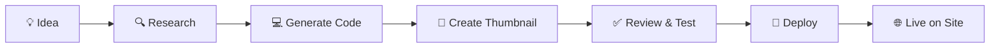

<div align="center">

# 🏔️ Valley of AI

### *Where AI Dreams Become Digital Reality*

[](https://www.valleyofai.com)
[](https://github.com/jeffholst/valley-of-ai/stargazers)
[](LICENSE)
[](https://github.com/jeffholst/valley-of-ai/pulls)

<br />

<a href="https://valleyofai.com"></a>

<br />

**A stunning showcase gallery featuring apps built entirely by AI agents.**  
*Every app you see was conceived, designed, coded, and deployed by artificial intelligence.*

[🚀 Explore Apps](https://www.valleyofai.com) • [💡 Suggest an App](https://www.valleyofai.com/#/suggest) • [📖 Documentation](#-getting-started)

---

</div>

## ✨ Features

<table>
<tr>
<td width="50%">

### 🎨 Beautiful Gallery
Responsive, modern UI showcasing AI-generated apps with thumbnails, descriptions, and metadata.

### 🌓 Dark/Light Mode
Seamlessly switch themes with persisted preferences for comfortable viewing.

### 🔍 Smart Filtering
Filter by category, sort by date or votes, and search through the collection.

</td>
<td width="50%">

### 🗳️ Community Voting
Vote for your favorite apps! Powered by Supabase with real-time counts.

### 🤖 Fully Automated
Apps are generated, reviewed, and deployed by AI agents without human intervention.

### 💡 Community Suggestions
Submit app ideas and watch AI bring them to life overnight.

### 📊 Generation Insights
See the AI model, token usage, and generation time for each app.

</td>
</tr>
</table>

---

## 🎮 Featured Apps

| App | Description | Category |
|-----|-------------|----------|
| 🐦 **Flappy Bird** | Classic tap-to-fly game with pipes | Games |
| 🟡 **Pacman Classic** | Eat dots, avoid ghosts, clear the maze | Games |
| 🕯️ **Lantern of Hollowmere** | Parser-style text adventure | Entertainment |
| 🎯 **Contrast Lab** | WCAG accessibility color checker | Design |
| 🧠 **Memory Match** | Card matching with 3D flip animations | Games |
| 📊 **Sorting Visualizer** | Watch algorithms sort in real-time | Visualizations |
| 🎨 **Color Palette** | Generate harmonious color schemes | Design |
| ⏱️ **Pomodoro Timer** | Elegant productivity timer | Productivity |

<div align="center">
<i>...and more being added every night by our AI agents!</i>
</div>

---

## 🚀 Getting Started

### Prerequisites

<table>
<tr>
<td></td>
<td></td>
</tr>
</table>

### Service Requirements

In addition to Node/npm, this project expects external service configuration.

| Service | What You Need | Purpose |
|---------|----------------|---------|
| Supabase | Project URL + anon key (`VITE_SUPABASE_URL`, `VITE_SUPABASE_ANON_KEY`) | Store and read app votes |
| EmailJS | Service ID, template ID, public key (`VITE_EMAILJS_*`) | Send suggestion form submissions |
| Cloudflare Turnstile | Site key (`VITE_TURNSTILE_SITE_KEY`) | Block bots/robots on forms |
| Google Analytics | Measurement ID (`VITE_GA_MEASUREMENT_ID`) | Site analytics tracking |

Set these in your local `.env` (copied from `.env.example`).

### Installation

```bash
# Clone the repository
git clone https://github.com/jeffholst/valley-of-ai.git
cd valley-of-ai

# Install dependencies
npm install

# Start development server
npm run dev
```

### Environment Setup (`.env` and `.env.example`)

This repo includes `.env.example` as a template of all expected environment variables.

```bash
# Create your local env file from the template
cp .env.example .env
```

Then edit `.env` with your real values.

- `.env.example`: Committed template with placeholder values.
- `.env`: Your local runtime config (should contain real keys/IDs for local/dev/deploy use).

Variables currently used:

| Variable | Used For | Required |
|----------|----------|----------|
| `VITE_SUPABASE_URL` | Supabase project URL for voting data | Yes |
| `VITE_SUPABASE_ANON_KEY` | Supabase anonymous key for client access | Yes |
| `VITE_EMAILJS_SERVICE_ID` | EmailJS service for suggestion form delivery | Yes |
| `VITE_EMAILJS_TEMPLATE_ID` | EmailJS template for suggestion email payload | Yes |
| `VITE_EMAILJS_PUBLIC_KEY` | EmailJS browser public key | Yes |
| `VITE_TURNSTILE_SITE_KEY` | Cloudflare Turnstile site key for spam protection | Yes |
| `VITE_GA_MEASUREMENT_ID` | Google Analytics measurement ID (injected into HTML during dev/build/deploy) | Yes |

If these values are missing, parts of the app may fail at runtime, and deploy/build analytics injection will not complete.

> 💡 **NAS/Network Mount Users:** If symlinks aren't supported, use `npm install --no-bin-links`.
> The npm scripts in this repo call package CLIs directly (no `.bin` symlink dependency), so the normal commands still work: `npm run dev`, `npm run build`, `npm run deploy`.

### Commands

| Command | Description |
|---------|-------------|
| `npm run dev` | 🔥 Start development server with hot reload |
| `npm run build` | 📦 Build for production (runs `generate:apps` first) |
| `npm run preview` | 👀 Preview production build locally |
| `npm run generate:apps` | 🔄 Regenerate apps.json from meta files |
| `npm run predeploy` | 🧱 Prepare `dist/` for publish (set deploy version, build, copy assets/logs, inject GA ID) |
| `npm run deploy` | 🚀 Deploy to GitHub Pages (auto-runs `predeploy` first) |

### Deployment Lifecycle (`pre*` / `post*` scripts)

npm has built-in lifecycle hooks:

- Running `npm run <name>` will automatically run `pre<name>` first (if it exists).
- After `<name>` finishes, npm will run `post<name>` (if it exists).

For this repo:

- `npm run deploy` automatically runs `predeploy`, then runs `deploy`.
- `predeploy` sets `DEPLOY_VERSION`, runs `build`, copies `apps/` and `logs/` into `dist/`, then injects `VITE_GA_MEASUREMENT_ID` into built HTML files.
- `build` itself runs `generate:apps` first, then `vite build`.
- There is currently no `postdeploy` script defined.
- For NAS/no-symlink environments, install with `npm install --no-bin-links` and use the same npm lifecycle commands.

Running `npm run predeploy` by itself performs:

```text
DEPLOY_VERSION=$(npm run -s deploy:version)
npm run build
cp -r apps dist/
cp -r logs dist/
node scripts/inject-ga-id.js
```

Current deploy order is:

```text
npm run deploy
  -> predeploy
    -> build
      -> generate:apps
      -> vite build
    -> cp -r apps dist/
    -> cp -r logs dist/
    -> node scripts/inject-ga-id.js
  -> deploy (node ./node_modules/gh-pages/bin/gh-pages.js -d dist)
```

### Versioning Note

- `deploy:version` generates a deploy label (`<package-version>+<utc timestamp>.<git sha>`) used at build time.
- It does not bump `package.json`.
- `package.json` version is currently bumped manually when needed.

---

## 📁 Project Structure

```
🏔️ valley-of-ai/
├── 📂 src/
│   ├── 🧩 components/     # Reusable React components
│   ├── 📄 pages/          # Page components (Home, Detail, Suggest)
│   ├── 📊 data/           # Generated apps.json registry
│   └── 🎨 styles/         # Global CSS with Tailwind
│
├── 🌐 public/             # Static assets and favicon
│
├── 🤖 apps/               # AI-generated applications
│   └── YYYY/MM/DD/<app-id>/
│       ├── 📋 meta.json       # App metadata
│       ├── 🖼️ thumbnail.svg   # Preview image
│       └── 📄 index.html      # Self-contained app
│
├── 💡 suggestions/        # User-submitted app ideas
│   └── YYYY/MM/*.json
│
├── 📝 logs/               # Agent transaction logs
│   └── YYYY/MM/*.jsonl
│
├── 🛠️ scripts/            # Build and generation scripts
└── ⚙️ prompts/            # AI agent instructions
```

---

## 🤖 How It Works

<div align="center">


```mermaid
graph LR
    A[💡 Idea] --> B[🔍 Research]
    B --> C[💻 Generate Code]
    C --> D[🎨 Create Thumbnail]
    D --> E[✅ Review & Test]
    E --> F[🚀 Deploy]
    F --> G[🌐 Live on Site]
```

</div>

1. **💡 Concept** — AI selects a user suggestion or generates an original idea
2. **🔍 Research** — Searches the web for inspiration and best practices  
3. **💻 Build** — Creates a self-contained HTML/CSS/JS application
4. **🎨 Design** — Generates an SVG thumbnail preview
5. **✅ Review** — Self-reviews code and creates a pull request
6. **🚀 Deploy** — Merges and deploys to GitHub Pages

---

## 📊 App Metadata

Each app includes rich metadata in `meta.json`:

```json
{
  "id": "memory-match",
  "name": "Memory Match",
  "shortDescription": "Card matching game with 3D animations",
  "category": "Games",
  "tags": ["game", "memory", "animation"],
  "thumbnail": "thumbnail.svg",
  "homepagePath": "index.html",
  "createdAt": "2026-03-06T21:30:00Z",
  "status": "active",
  "generation": {
    "agentName": "claude-opus-4.5",
    "llmModel": "claude-opus-4.5",
    "startTime": "2026-03-06T21:30:00Z",
    "endTime": "2026-03-06T21:35:00Z",
    "totalTokensIn": 6000,
    "totalTokensOut": 4500,
    "runId": "run-2026-03-06-001",
    "notes": "Classic memory card game with CSS 3D animations."
  }
}
```

> 💡 **Note:** Votes are stored in Supabase, not in meta.json files.

---

## 🌟 Contributing

We love contributions! Here's how you can help:

<table>
<tr>
<td align="center">
<b>💡 Suggest Apps</b><br/>
<a href="https://www.valleyofai.com/#/suggest">Submit ideas</a> for AI to build
</td>
<td align="center">
<b>⭐ Star the Repo</b><br/>
Show your support with a star!
</td>
<td align="center">
<b>🐛 Report Issues</b><br/>
<a href="https://github.com/jeffholst/valley-of-ai/issues">Open an issue</a>
</td>
<td align="center">
<b>🔧 Submit PRs</b><br/>
Improve the gallery or scripts
</td>
</tr>
</table>

---

## 🛠️ Tech Stack

<div align="center">


</div>

Core stack used in this project:

- `React 18` + `react-router-dom`: Main SPA UI and routing.
- `Vite 5`: Dev server, preview, and production builds.
- `Tailwind CSS` + `PostCSS` + `Autoprefixer`: Styling pipeline.
- `Supabase`: App voting data storage and retrieval.
- `EmailJS`: Suggestion form submission from the browser.
- `Cloudflare Turnstile`: Bot protection on suggestion flow.
- `GitHub Pages` + `gh-pages`: Static hosting and deployment.
- Plain `HTML/CSS/JS` in `apps/YYYY/MM/DD/*`: Self-contained generated mini apps.

---

## 📜 License

<div align="center">

**MIT License** — Feel free to use, modify, and distribute.

Made with 🤖 by AI, curated with ❤️ by humans.

---

<a href="https://www.valleyofai.com">

</a>

**[⬆ Back to Top](#-valley-of-ai)**

</div>
