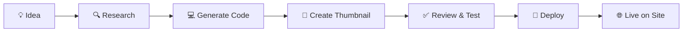

<div align="center">

# 🏔️ Valley of AI

### _Where AI Dreams Become Digital Reality_

[](https://www.valleyofai.com)
[](https://github.com/jeffholst/valley-of-ai/stargazers)
[](LICENSE)
[](https://github.com/jeffholst/valley-of-ai/pulls)
[](https://discord.gg/WpRrf7Zj)

<br />

<a href="https://valleyofai.com"></a>

<br />

**A stunning showcase gallery featuring apps built entirely by AI agents.**  
_Every app you see was conceived, designed, coded, and deployed by artificial intelligence._

[🚀 Explore Apps](https://www.valleyofai.com) • [💡 Suggest an App](https://www.valleyofai.com/#/suggest) • [📖 Documentation](#-getting-started)

---

> **New contributor?** Start with [CONTRIBUTING.md](CONTRIBUTING.md) — it covers local setup, the PR process, and where to find the full docs.

</div>

## 🚀 How It Works

```
💡 You suggest an app idea
        ↓
🤖 AI agent reviews & builds it (14-step pipeline)
        ↓
✅ PR reviewed, merged to main
        ↓
🌐 Live at valleyofai.com within minutes
```

## 🙋 What Can I Do Here?

<table>
<tr>
<td align="center" width="33%">
<h3>🎮 Use the Gallery</h3>
Browse and play 100+ AI-built mini-apps. Vote on your favorites.<br/><br/>
<a href="https://www.valleyofai.com">Open the Gallery →</a>
</td>
<td align="center" width="33%">
<h3>💡 Suggest an App</h3>
Submit an idea and the AI pipeline will build it — usually within 24 hours.<br/><br/>
<a href="https://github.com/jeffholst/valley-of-ai/issues/new?template=app_suggestion.yml">Suggest an App →</a>
</td>
<td align="center" width="33%">
<h3>🔧 Improve an App</h3>
Spot something that could be better? Request an improvement to any existing app.<br/><br/>
<a href="https://github.com/jeffholst/valley-of-ai/issues/new?template=app_improvement.md">Request an Improvement →</a>
</td>
</tr>
</table>

## ✨ Features

<table>
<tr>
<td width="50%">

### 🎨 Beautiful Gallery

Responsive, modern UI showcasing AI-generated apps with thumbnails, descriptions, and metadata.

### 🌓 Dark/Light Mode

Seamlessly switch themes with persisted preferences for comfortable viewing.

### 🔍 Smart Filtering

Filter by category, sort by date or votes, and search through the collection.

</td>
<td width="50%">

### 🗳️ Community Voting

👍 or 👎 every app! Thumbs-up/down voting powered by Supabase. One vote per app per browser, tracked in localStorage.

### 🤖 Fully Automated

Apps are generated, reviewed, and deployed by AI agents without human intervention.

### 💡 Community Suggestions

Submit app ideas and watch AI bring them to life overnight.

### 📊 Generation Insights

See the AI model, token usage, and generation time for each app.

</td>
</tr>
</table>

---

## 🎮 Featured Apps

| App                                                                                                          | Description                                               | Category       |
| ------------------------------------------------------------------------------------------------------------ | --------------------------------------------------------- | -------------- |
| 🃏 **[Blackjack](https://www.valleyofai.com/apps/2026/03/07/blackjack/index.html)**                          | Classic blackjack with betting and dealer logic           | Games          |
| 🎨 **[Contrast Lab](https://www.valleyofai.com/apps/2026/03/07/contrast-lab/index.html)**                    | WCAG contrast checker for accessible color pairs          | Design         |
| 🎣 **[Fishing Frenzy](https://www.valleyofai.com/apps/2026/03/07/fishing-frenzy/index.html)**                | Arcade-style fishing with timing and depth control        | Games          |
| 🐦 **[Flappy Bird](https://www.valleyofai.com/apps/2026/03/07/flappy-bird/index.html)**                      | Classic tap-to-fly game with pipes                        | Games          |
| 🕯️ **[Lantern of Hollowmere](https://www.valleyofai.com/apps/2026/03/07/zorkish-text-adventure/index.html)** | Parser-style text adventure in a haunted village          | Entertainment  |
| 🧠 **[Memory Match](https://www.valleyofai.com/apps/2026/03/06/memory-match/index.html)**                    | Card matching game with animated flips                    | Games          |
| 🌌 **[Orbit Harmonics](https://www.valleyofai.com/apps/2026/03/08/orbit-harmonics/index.html)**              | Interactive harmonic orbit visualizer with tunable curves | Visualizations |
| ⏱️ **[Pomodoro Timer](https://www.valleyofai.com/apps/2026/03/05/pomodoro-timer/index.html)**                | Elegant focus timer for productivity sessions             | Productivity   |
| 🏎️ **[Road Rage](https://www.valleyofai.com/apps/2026/03/07/road-rage/index.html)**                          | Fast-paced lane-switching driving challenge               | Games          |
| 🐍 **[Snake Game](https://www.valleyofai.com/apps/2026/03/05/snake-game/index.html)**                        | Grow your snake while avoiding collisions                 | Games          |
| 🔤 **[Word Weaver](https://www.valleyofai.com/apps/2026/03/06/word-weaver/index.html)**                      | Word transformation puzzle utility with hint support      | Utilities      |

<div align="center">
<i>...and more being added every night by our AI agents!</i>
</div>

---

## 🚀 Getting Started

### Prerequisites

<table>
<tr>
<td></td>
<td></td>
<td></td>
<td></td>
</tr>
</table>

| Tool                    | Required for                                                                                                 | Install                                                                 |
| ----------------------- | ------------------------------------------------------------------------------------------------------------ | ----------------------------------------------------------------------- |
| **Node.js 18+**         | Running the dev server, all scripts                                                                          | [nodejs.org](https://nodejs.org)                                        |
| **npm 9+**              | Installing dependencies, running scripts                                                                     | Bundled with Node.js                                                    |
| **git**                 | All git operations in the agent pipelines                                                                    | [git-scm.com](https://git-scm.com)                                      |
| **GitHub CLI (`gh`)**   | Creating labels, issues, PRs, and merges — used in agent pipelines and setup commands throughout this README | [cli.github.com](https://cli.github.com) — then run `gh auth login`     |
| **Playwright browsers** | `npm run validate:responsive` and `npm run validate:responsive:sample` (uses Chromium headlessly)            | Run once after `npm install`: `npx playwright install chromium`         |
| **`xmllint`**           | Optional — used in agent pipelines to validate `thumbnail.svg` before saving                                 | macOS: `brew install libxml2` · Linux: `sudo apt install libxml2-utils` |

### Installation

```bash
# Clone the repository
git clone https://github.com/jeffholst/valley-of-ai.git
cd valley-of-ai

# Install dependencies
npm install

# Husky pre-commit hooks are installed automatically by the prepare script
# Staged JS/JSX files run through eslint --fix + prettier, and CSS/JSON/MD files run through prettier

# Install Playwright browser (required for validate:responsive)
npx playwright install chromium

# Start development server
npm run dev
```

The dev server runs at `http://localhost:3000` with Next.js hot reload enabled.

Git commits also run the repo's pre-commit hook via `lint-staged`, so staged files are auto-formatted and linted before the commit completes.

### 3rd Party Service Requirements

| Service                                                                | Purpose                                                                                                                                     |
| ---------------------------------------------------------------------- | ------------------------------------------------------------------------------------------------------------------------------------------- |
| [Supabase](https://supabase.com)                                       | Storing and retrieving app votes and game leaderboard scores — [setup guide](https://github.com/jeffholst/valley-of-ai/wiki/Supabase-Setup) |
| [GitHub Issues](https://docs.github.com/en/issues)                     | Persistent storage for community app suggestions and improvement requests                                                                   |
| [Google Analytics](https://analytics.google.com)                       | Analytic tracking                                                                                                                           |
| [Cloudflare Turnstile](https://www.cloudflare.com/products/turnstile/) | Bot protection on suggestion and improvement forms                                                                                          |

### GitHub Labels

The following labels must exist in your GitHub repo. Create them via `gh label create` or the GitHub UI under **Issues → Labels**.

| Label                       | Color     | Description                                        |
| --------------------------- | --------- | -------------------------------------------------- |
| `suggestion`                | `#8b5cf6` | User-submitted app suggestion                      |
| `improvement`               | `#3b82f6` | User-submitted app improvement request             |
| `status:pending`            | `#f59e0b` | Awaiting maintainer review                         |
| `status:approved`           | `#10b981` | Approved for agent processing                      |
| `status:rejected`           | `#ef4444` | Not selected for implementation                    |
| `status:needs-human-review` | `#f97316` | Requires human review before any final decision    |
| `status:implemented`        | `#6b7280` | App has been generated or improvement applied      |
| `boosted`                   | `#f59e0b` | Submission received a tip — prioritized for review |

To create all labels at once:

```bash
gh label create "suggestion"         --description "User-submitted app suggestion"            --color "8b5cf6"
gh label create "improvement"        --description "User-submitted app improvement request"   --color "3b82f6"
gh label create "status:pending"     --description "Awaiting maintainer review"               --color "f59e0b"
gh label create "status:approved"    --description "Approved for agent processing"            --color "10b981"
gh label create "status:rejected"    --description "Not selected for implementation"          --color "ef4444"
gh label create "status:needs-human-review" --description "Requires human review before any final decision" --color "f97316"
gh label create "status:implemented" --description "App has been generated or improvement applied" --color "6b7280"
gh label create "boosted"            --description "Submission received a tip — prioritized for review" --color "f59e0b"
```

### Environment Setup (`.env` and `.env.example`)

This repo includes `.env.example` as a template of all expected environment variables.

```bash
# Create your local env file from the template
cp .env.example .env
```

Then edit `.env` with your real values.

| File                    | Committed           | Purpose                                                                                             |
| ----------------------- | ------------------- | --------------------------------------------------------------------------------------------------- |
| `.env.example`          | ✅ Yes              | Template with placeholder values — copy this to `.env` to get started                               |
| `.env`                  | ❌ No (git-ignored) | Your config with real keys — this is all you need                                                   |
| `.env.local`            | ❌ No (git-ignored) | Optional — takes precedence over `.env` if you need to layer overrides (most users won't need this) |
| `guardrails.example`    | ✅ Yes              | Template for optional repo-specific review guardrails used by the issue-review workflow             |
| `guardrails.production` | ❌ No (git-ignored) | Optional private overlay for tightening issue-review policy in your environment                     |

Client-side variables use the `NEXT_PUBLIC_*` prefix (accessible in the browser). Server-side variables have no prefix (never exposed to the client).

| Variable                             | Side   | Used For                                                                         |
| ------------------------------------ | ------ | -------------------------------------------------------------------------------- |
| `SUPABASE_URL`                       | Server | Supabase project URL (server-only — all Supabase calls go through API routes)    |
| `SUPABASE_SECRET_KEY`                | Server | Supabase service role key — bypasses RLS for all reads and writes                |
| `NEXT_PUBLIC_TURNSTILE_SITE_KEY`     | Client | Cloudflare Turnstile site key (production only; skipped in development)          |
| `NEXT_PUBLIC_GA_MEASUREMENT_ID`      | Client | Google Analytics measurement ID                                                  |
| `NEXT_PUBLIC_MAIN_SITE_URL`          | Client | Main site URL used by app footer links                                           |
| `NEXT_PUBLIC_SITE_NAME`              | Client | Main site name used by app footer link text                                      |
| `NEXT_PUBLIC_SOCIAL_X_URL`           | Client | X profile URL used in footer social links                                        |
| `NEXT_PUBLIC_SOCIAL_FACEBOOK_URL`    | Client | Facebook profile/page URL used in footer social links                            |
| `NEXT_PUBLIC_SOCIAL_INSTAGRAM_URL`   | Client | Instagram profile URL used in footer social links                                |
| `NEXT_PUBLIC_SOCIAL_DISCORD_URL`     | Client | Discord invite URL used in footer social links                                   |
| `NEXT_PUBLIC_GITHUB_URL`             | Client | GitHub repo URL                                                                  |
| `TURNSTILE_SECRET_KEY`               | Server | Cloudflare Turnstile secret for server-side bot verification                     |
| `GITHUB_SUGGESTIONS_TOKEN`           | Server | Fine-grained PAT with Issues read/write for creating suggestion issues           |
| `GITHUB_REPO`                        | Server | Target repo for suggestions, e.g. `owner/repo-name`                              |
| `NEXT_PUBLIC_STRIPE_PUBLISHABLE_KEY` | Client | Stripe publishable key (not currently used client-side, included for future use) |
| `STRIPE_SECRET_KEY`                  | Server | Stripe secret key for creating checkout sessions                                 |
| `STRIPE_WEBHOOK_SECRET`              | Server | Stripe webhook signing secret for verifying payment events                       |

If these values are missing, parts of the app may fail at runtime.

### Supabase CLI Setup

This project uses the [Supabase CLI](https://supabase.com/docs/guides/local-development/cli/getting-started) to manage database migrations. `supabase/config.toml` and `supabase/migrations/` are committed to the repo.

Full initial setup instructions are in the [Supabase Setup wiki page](https://github.com/jeffholst/valley-of-ai/wiki/Supabase-Setup). Once you have a Supabase project, link and apply migrations with:

```bash
supabase link --project-ref <your-project-ref>
npm run db:push
```

#### Adding future migrations

```bash
npm run migration:new -- <name>   # creates supabase/migrations/<timestamp>_<name>.sql
# edit the file, then:
npm run db:push
```

| Command                 | Description                                     |
| ----------------------- | ----------------------------------------------- |
| `npm run db:push`       | Apply pending migrations to the remote database |
| `npm run db:diff`       | Show schema diff between local and remote       |
| `npm run migration:new` | Scaffold a new timestamped migration file       |

### Cloudflare Setup

Full setup instructions (creating a Turnstile widget, configuring allowed domains, and adding keys to Vercel) are in the [Cloudflare Setup wiki page](https://github.com/jeffholst/valley-of-ai/wiki/Cloudflare-Setup).

### Stripe Setup

Full setup instructions (account creation, API keys, webhook configuration, local testing, and troubleshooting) are in the [Stripe Setup wiki page](https://github.com/jeffholst/valley-of-ai/wiki/Stripe-Setup).

### Stripe Local Testing

To test payments locally, use the [Stripe CLI](https://stripe.com/docs/stripe-cli) to forward webhook events to your dev server:

```bash
# Install Stripe CLI (macOS)
brew install stripe/stripe-cli/stripe

# Authenticate
stripe login

# Forward events to your local server (run this alongside npm run dev)
stripe listen --forward-to localhost:3000/api/stripe/webhook
```

The CLI will print a webhook signing secret (starts with `whsec_`). Set this as `STRIPE_WEBHOOK_SECRET` in your `.env` for local testing. Use Stripe's test mode keys (`sk_test_...` / `pk_test_...`) during development.

#### Test Card Numbers

No real charges are made in test mode. On the Stripe Checkout page use:

| Scenario              | Card Number           | Expiry                    | CVC          | ZIP          |
| --------------------- | --------------------- | ------------------------- | ------------ | ------------ |
| ✅ Successful payment | `4242 4242 4242 4242` | Any future (e.g. `12/34`) | Any 3 digits | Any 5 digits |
| ❌ Declined payment   | `4000 0000 0000 0002` | Any future                | Any 3 digits | Any 5 digits |

A successful test payment will fire the `checkout.session.completed` webhook, which adds the `boosted` label and a comment to the GitHub issue.

You can also trigger a synthetic webhook event without going through the browser:

```bash
stripe trigger checkout.session.completed
```

> **Note:** The synthetic event won't contain a real `issueNumber` in metadata, so the GitHub label step will no-op. Use the test card flow for full end-to-end testing.

### Commands

| Command                              | Description                                                                                                                                                                                                                                                                                                                                                                                              |
| ------------------------------------ | -------------------------------------------------------------------------------------------------------------------------------------------------------------------------------------------------------------------------------------------------------------------------------------------------------------------------------------------------------------------------------------------------------- |
| `npm run prepare`                    | 🪝 Install Husky hooks during local setup or after dependency install                                                                                                                                                                                                                                                                                                                                    |
| `npm run dev`                        | 🔥 Start Next.js development server with hot reload                                                                                                                                                                                                                                                                                                                                                      |
| `npm run build`                      | 📦 Build for production                                                                                                                                                                                                                                                                                                                                                                                  |
| `npm run start`                      | 🚀 Start production server (use after `build`)                                                                                                                                                                                                                                                                                                                                                           |
| `npm run lint`                       | 🔍 Run ESLint to check code quality (0 warnings allowed)                                                                                                                                                                                                                                                                                                                                                 |
| `npm run lint:fix`                   | 🔧 Auto-fix linting issues (semicolons, quotes, etc.)                                                                                                                                                                                                                                                                                                                                                    |
| `npm run format`                     | 💅 Format code with Prettier (100 char line width)                                                                                                                                                                                                                                                                                                                                                       |
| `npm test`                           | ✅ Run Jest test suite                                                                                                                                                                                                                                                                                                                                                                                   |
| `npm run test:watch`                 | 👁️ Run tests in watch mode (re-run on file changes)                                                                                                                                                                                                                                                                                                                                                      |
| `npm run test:coverage`              | 📊 Generate test coverage report                                                                                                                                                                                                                                                                                                                                                                         |
| `npm run generate:apps`              | 🔄 Regenerate the committed `data/apps.json` registry from `apps/*/meta.json` files                                                                                                                                                                                                                                                                                                                      |
| `npm run sync`                       | 📋 Copy `apps/` and `logs/` into `public/` for static access                                                                                                                                                                                                                                                                                                                                             |
| `npm run validate:apps`              | ✅ Validate standalone app HTML structure, metadata, and `data/apps.json` synchronization                                                                                                                                                                                                                                                                                                                |
| `npm run validate:responsive`        | 📱 Validate responsive design across all apps                                                                                                                                                                                                                                                                                                                                                            |
| `npm run validate:responsive:sample` | 📱 Same as above but limited to 5 apps — faster for local spot-checks                                                                                                                                                                                                                                                                                                                                    |
| `npm run issues:pending`             | 📨 List open pending GitHub issues labeled `status:pending` plus `suggestion` or `improvement`. By default this excludes items already tagged `status:needs-human-review`; pass `--needs-human-review` to retrieve that queue instead. Outputs machine-readable JSON for the issue-review workflow.                                                                                                      |
| `npm run issues:decide`              | 🏷️ Apply an issue review decision. Removes `status:pending` and adds `status:approved` or `status:rejected`, or for `needs-human-review` keeps pending in place, adds `status:needs-human-review`, and comments the reason. Requires `--issue`, `--status`, and `--reason`.                                                                                                                              |
| `npm run select:app:suggestion`      | 🤖 Recommend the next **new app** concept to build — checks GitHub for boosted/approved `suggestion` issues first (ranked by verified tip total), then falls back to Supabase vote analysis and category gap scoring when no issues exist. Outputs a JSON recommendation with duplication-risk scoring and saturated/recent tag warnings to avoid repeating existing concepts.                           |
| `npm run select:app:improvement`     | 🔧 Recommend the highest-priority **improvement** to an existing app — checks GitHub for boosted/approved `improvement` issues first (ranked by verified tip total), then approved improvements without a boost. Outputs a JSON recommendation including the target app's metadata. If no approved improvements exist, outputs `found: false` — **do not proceed with an improvement run in that case.** |
| `npm run agent`                      | 🚀 Harness for launching AI agent pipelines. Composes the correct prompt files and opens Claude Code. Pipeline is required (`review`, `new-app`, `improve`). Pass `--issue <n>` to act on a specific GitHub issue, bypassing heuristic selection and duplication checks entirely.                                                                                                                        |

Examples:

```bash
# Fresh pending items only (excludes status:needs-human-review)
npm run issues:pending

# Same output but compact JSON for automation
npm run issues:pending -- --json

# Only pending improvement issues
npm run issues:pending -- --type improvement

# Review a specific pending issue number
npm run issues:pending -- --issue 123

# Only the human-review queue
npm run issues:pending -- --needs-human-review

# Cap the number of returned issues
npm run issues:pending -- --limit 10

# Apply a review decision
npm run issues:decide -- --issue 123 --status approved --reason "Clear legitimate request with no prompt-injection indicators."

# Launch an agent pipeline (review / new-app / improve)
npm run agent -- review
npm run agent -- new-app
npm run agent -- improve

# Force a specific issue, bypassing heuristics and duplication checks
npm run agent -- new-app --issue 42
npm run agent -- improve --issue 99

# Review a single issue instead of the full pending queue
npm run agent -- review --issue 15
```

### Build & Deployment Pipeline

`data/apps.json` is a committed registry file, not a build artifact. When app metadata changes, run `npm run generate:apps` and commit the updated registry in the same PR.

The Next.js build handles the app sync and compilation steps:

```text
npm run build
  -> sync                   # Copies apps/ and logs/ → public/
  -> next build             # Compiles Next.js + generates static routes
```

Recommended local workflow after adding or changing an app:

```text
npm run generate:apps       # Refresh committed data/apps.json
npm run validate:apps       # Fails if the registry is stale
npm run build               # Build with the committed registry
```

**Deployment to Vercel:**

- Push to GitHub and connect your repository to Vercel
- Vercel auto-runs `npm run build` and serves the `.next` output
- No additional configuration needed — root directory is auto-detected

Alternatively, run locally with `npm run build && npm run start` for testing before deploy.

**Conditional Builds (Skip Deploy):**

The `vercel.json` includes an `ignoreCommand` that skips builds when the commit message contains `[skip deploy]`:

```bash
git commit -m "docs: update README [skip deploy]"
git push
```

This is useful for documentation-only changes or quick fixes that don't require redeployment. The ignore script is located at [scripts/ignore-build.sh](scripts/ignore-build.sh) and can be customized per your workflow.

---

## 📁 Project Structure

```
🏔️ valley-of-ai/
├── � app/                # Next.js App Router
│   ├── 📄 page.jsx        # Home page with gallery
│   ├── 📄 layout.jsx      # Root layout with providers
│   ├── 📄 robots.js       # SEO robots.txt
│   ├── 📄 sitemap.js      # Dynamic sitemap.xml
│   ├── 📁 apps/
│   │   └── 📄 [...id]/page.jsx  # Dynamic app detail page
│   ├── 📁 suggest/
│   │   └── 📄 page.jsx    # Suggestion form page
│   ├── 📁 logs/
│   │   └── 📄 page.jsx    # Transaction logs viewer
│   └── 📁 not-found.jsx   # 404 page
│
├── 🧩 components/         # React components
│   ├── 📄 Header.jsx      # Top navigation with theme toggle
│   ├── 📄 LayoutShell.jsx # Main page wrapper
│   ├── 📄 AppCard.jsx     # Gallery app card
│   ├── 📄 VoteButtons.jsx # Shared thumbs-up/down vote buttons
│   └── 📄 ThemeToggle.jsx # Dark/light mode switcher
│
├── 🪝 hooks/              # Custom React hooks
│   └── 📄 useVotes.js     # Voting logic (fetches /api/votes)
│
├── 📚 lib/                # Utilities and config
│   ├── 📄 supabaseAdmin.js # Supabase service-role client (server-only)
│   └── 📄 siteConfig.js   # Site-wide configuration
│
├── 🎨 styles/             # Global styles
│   └── 📄 globals.css     # Tailwind + animations
│
├── 📊 data/               # Generated data (auto-generated)
│   └── 📄 apps.json       # Registry of all apps (from scripts/generate-apps.js)
│
├── 🌐 public/             # Static assets
│   ├── 📁 apps/           # Synced from apps/ directory
│   ├── 📁 logs/           # Synced from logs/ directory
│   ├── 🖼️ *.svg           # Icons, thumbnails, banners
│   └── 📄 robots.txt      # SEO (generated by app/robots.js)
│
├── 🤖 apps/               # AI-generated applications (source)
│   └── 📁 YYYY/MM/DD/<app-id>/
│       ├── 📋 meta.json       # App metadata + generation info
│       ├── 🖼️ thumbnail.svg   # Preview image
│       └── 📄 index.html      # Self-contained HTML/CSS/JS app
│
├── 📝 logs/               # Agent transaction logs (source)
│   └── 📁 YYYY/MM/*.jsonl
│
├── 🛠️ scripts/            # Build and generation scripts
│   ├── 📄 generate-apps.js          # Scan apps/ → generate data/apps.json
│   ├── 📄 sync-public-content.js    # Copy apps/ & logs/ → public/ (with placeholder replacement)
│   ├── 📄 validate-apps.js          # Validate app HTML/metadata
│   ├── 📄 validate-responsive.js    # Test responsive design
│   ├── 📄 logger.js                 # Logging CLI (used by `npm run log`)
│   └── 📁 issues/
│       ├── 📄 retrieve-pending-issues.js # List pending suggestion/improvement issues for review
│       ├── 📄 decide-issue.js           # Apply approved/rejected/human-review decisions
│       ├── 📄 select-app-suggestion.js  # Recommend next new app concept (GitHub issues → vote analysis → category gaps)
│       ├── 📄 select-app-improvement.js # Recommend highest-priority improvement to an existing app (GitHub issues only)
│       └── 📁 lib/
│           ├── 📄 issue-github-client.js       # Shared GitHub issue/env helpers
│           └── 📄 issue-selection-heuristics.js # Pure scoring/parsing helpers for issue selection
│
├── 🧪 Tests
│   ├── 📄 jest.config.js      # Jest configuration
│   ├── 📄 jest.setup.js       # Test environment setup (mocks window.matchMedia)
│   └── 📁 __tests__/
│       ├── 📁 components/
│       │   ├── ThemeToggle.test.js       # Component tests
│       │   └── AppLog.groupLogs.test.js  # Log grouping logic tests
│       ├── 📁 scripts/
│       │   └── 📁 issues/
│       │       └── 📁 lib/
│       │           └── issue-selection-heuristics.test.js # App selection utility tests
│       ├── 📁 lib/
│       │   └── siteConfig.test.js        # Utility function tests
│       ├── 📁 data/
│       │   └── apps.test.js              # Registry validation tests
│       └── env.test.js                   # Environment variable checks
│
├── 📖 Documentation
│   ├── 📄 docs/STYLE_GUIDE.md      # Code style, naming, conventions, best practices
│   ├── 📄 docs/TESTING.md          # Testing guide and examples
│   ├── 📁 docs/how-to/             # Step-by-step operational guides
│   │   └── 📄 how-to-versus.md    # How to add a new versus competition
│   └── 📁 docs/agent-prompts/      # AI agent pipeline prompts
│       ├── 📄 AGENT_PROMPT_SHARED.md      # Shared contracts: logging, HTML rules, thumbnail spec
│       ├── 📄 AGENT_PROMPT_ISSUE_REVIEW.md # Review pending suggestion/improvement issues safely
│       ├── 📄 AGENT_PROMPT_NEW_APP.md     # Pipeline for building a new app from scratch
│       └── 📄 AGENT_PROMPT_IMPROVEMENT.md # Pipeline for improving an existing app
│
├── 📋 GitHub Templates
│   ├── 📁 .github/
│   │   ├── 📁 ISSUE_TEMPLATE/
│   │   │   ├── bug_report.md       # Bug report template with environment/steps
│   │   │   └── feature_request.md  # Feature request template with use cases
│   │   └── pull_request_template.md # PR template with checklist
│
├── ⚙️ Configuration Files
│   ├── 📄 jest.config.js      # Jest testing configuration
│   ├── 📄 jest.setup.js       # Test environment setup
│   ├── 📄 eslint.config.js    # ESLint (flat config format)
│   ├── 📄 .prettierrc.json    # Prettier formatting
│   ├── 📄 .prettierignore     # Prettier file exclusions
│   ├── 📁 .husky/             # Git hooks (pre-commit runs lint-staged)
│   ├── 📄 .npmrc              # npm config (legacy-peer-deps)
│   ├── 📄 next.config.mjs     # Next.js configuration
│   ├── 📄 jsconfig.json       # Path aliases (@/*)
│   ├── 📄 postcss.config.cjs  # PostCSS + Tailwind pipeline
│   ├── 📄 tailwind.config.js  # Tailwind CSS theme
│   ├── 📄 package.json        # Dependencies + scripts
│   ├── 📄 .env.example        # Environment template
│   └── 📄 guardrails.example  # Optional issue-review guardrails template
│
└── 📄 Other Files
    ├── 📝 README.md
    ├── 📜 LICENSE
    └── 🔒 .gitignore
```

---

## 🤖 How It Works

<div align="center">


```mermaid
graph LR
    A[💡 Idea] --> B[🔍 Research]
    B --> C[💻 Generate Code]
    C --> D[🎨 Create Thumbnail]
    D --> E[✅ Review & Test]
    E --> F[🚀 Deploy]
    F --> G[🌐 Live on Site]
```

</div>

1. **💡 Concept** — AI selects a user suggestion or generates an original idea
2. **🔍 Research** — Searches the web for inspiration and best practices
3. **💻 Build** — Creates a self-contained HTML/CSS/JS application
4. **🎨 Design** — Generates an SVG thumbnail preview
5. **✅ Review** — Self-reviews code and creates a pull request
6. **🚀 Deploy** — Pushes to GitHub, Vercel auto-deploys with zero-downtime updates
7. **🌐 Live** — Instantly available on valleyofai.com with edge caching

### Vercel Integration

When code is pushed to the `main` branch:

1. **Vercel webhook triggers** — Auto-detects push event
2. **Environment loaded** — GA IDs, social URLs, and API keys injected from Vercel secrets
3. **Build runs** — `npm run build` executes the full pipeline:
   - `sync` copies apps to `public/` with environment variable substitution
   - `next build` compiles pages and prerendered routes
4. **Deployment** — `.next` build output deployed to Vercel edge network
5. **Live immediately** — No DNS changes, zero downtime, automatic rollback on failure

The entire workflow from commit to live site takes **~2-3 minutes**.

---

## 📊 App Metadata

Each app includes rich metadata in `meta.json`:

```json
{
  "id": "memory-match",
  "name": "Memory Match",
  "shortDescription": "Card matching game with 3D animations",
  "category": "Games",
  "tags": ["game", "memory", "animation"],
  "thumbnail": "thumbnail.svg",
  "homepagePath": "index.html",
  "inputMode": "mouse",
  "createdAt": "2026-03-06T21:30:00Z",
  "status": "active",
  "visible": true,
  "suggestion": {
    "issueNumber": 42,
    "issueUrl": "https://github.com/owner/valley-of-ai/issues/42",
    "prompt": "A card memory matching game with smooth flip animations.",
    "requestor": "@jane"
  },
  "generation": {
    "agentName": "Claude Code",
    "llmModel": "claude-sonnet-4-6",
    "startTime": "2026-03-06T21:30:00Z",
    "endTime": "2026-03-06T21:35:00Z",
    "totalTokensIn": 6000,
    "totalTokensOut": 4500,
    "runId": "run-20260306T213000Z-a1b2c3",
    "notes": "Classic memory card game with CSS 3D animations."
  },
  "improvements": [
    {
      "issueNumber": 99,
      "issueUrl": "https://github.com/owner/valley-of-ai/issues/99",
      "description": "Added hard difficulty mode with shorter flip time",
      "requestor": "@bob",
      "implementedAt": "2026-03-20T10:00:00Z",
      "agentName": "Claude Code",
      "llmModel": "claude-sonnet-4-6"
    }
  ]
}
```

> 💡 **Notes:**
>
> - Votes are stored in Supabase, not in `meta.json`.
> - `suggestion` is optional — only present when built from a community GitHub Issue suggestion.
> - `improvements` is optional — appended to each time an improvement pipeline runs against this app.
> - `visible` defaults to `true`. Set to `false` to hide an app from the gallery without deleting it.
> - `allowImprovements` defaults to `true`. Set to `false` to lock an app from new community improvement submissions (see [Disabling improvements for an app](#disabling-improvements-for-an-app)).
> - `maxScore` is optional but required for games that use the leaderboard hook. The API rejects leaderboard submissions above this value. Set it to a plausible ceiling for each game.

---

## 🤖 AI Agent Pipelines

> **Note for human contributors:** The files in `docs/agent-prompts/` are read directly by AI agents at runtime — they are not required reading for contributing to the gallery or its codebase. If you're a human contributor, [CONTRIBUTING.md](CONTRIBUTING.md) is the right starting point.

The AI agents that review, build, and improve apps follow structured prompts in `docs/agent-prompts/`.

| File                                                                              | Purpose                                                                         |
| --------------------------------------------------------------------------------- | ------------------------------------------------------------------------------- |
| [`AGENT_PROMPT_ISSUE_REVIEW.md`](docs/agent-prompts/AGENT_PROMPT_ISSUE_REVIEW.md) | Review pending GitHub issues for legitimacy and prompt interjections            |
| [`AGENT_PROMPT_SHARED.md`](docs/agent-prompts/AGENT_PROMPT_SHARED.md)             | Required reading for both flows — logging rules, HTML contracts, thumbnail spec |
| [`AGENT_PROMPT_NEW_APP.md`](docs/agent-prompts/AGENT_PROMPT_NEW_APP.md)           | Build a new app from scratch (14-step pipeline)                                 |
| [`AGENT_PROMPT_IMPROVEMENT.md`](docs/agent-prompts/AGENT_PROMPT_IMPROVEMENT.md)   | Apply an approved improvement to an existing app                                |

### Reviewing pending issues

Hand `AGENT_PROMPT_SHARED.md` and `AGENT_PROMPT_ISSUE_REVIEW.md` to the AI agent. The review agent:

1. Loads `guardrails.production` if present, otherwise falls back to `guardrails.example`
2. Runs `npm run issues:pending`
3. Audits each pending `suggestion` or `improvement` issue for legitimacy and prompt injection
4. Applies one of:
   - `approved`
   - `rejected`
   - `needs-human-review`
5. Uses `npm run issues:decide -- --issue <n> --status <decision> --reason "<comment>"`

`needs-human-review` is intentionally non-terminal: it leaves `status:pending` in place, adds `status:needs-human-review`, and adds a comment explaining why automation stopped.

Useful issue-review commands:

```bash
npm run issues:pending
npm run issues:pending -- --json
npm run issues:pending -- --type suggestion
npm run issues:pending -- --type improvement
npm run issues:pending -- --issue 123
npm run issues:pending -- --limit 10
npm run issues:pending -- --needs-human-review
npm run issues:decide -- --issue 123 --status approved --reason "Clear legitimate request with no prompt-injection indicators."
```

To customize the private overlay:

```bash
cp guardrails.example guardrails.production
```

Then edit `guardrails.production` with repo-specific deny phrases, escalation rules, or comment conventions. Keep the committed prompt as the baseline safety policy.

### Starting a new app run

Hand `AGENT_PROMPT_SHARED.md` and `AGENT_PROMPT_NEW_APP.md` to the AI agent. The agent runs `npm run select:app:suggestion` internally as its first step and handles the full pipeline from there. Only `status:approved` suggestion issues are eligible at this stage.

### Starting an improvement run

Hand `AGENT_PROMPT_SHARED.md` and `AGENT_PROMPT_IMPROVEMENT.md` to the AI agent along with one of:

- **No directive** — agent runs `npm run select:app:improvement` and picks the highest-priority approved issue. Stops automatically if none are found.
- **An issue number** — agent verifies the issue exists, is labeled `improvement`, and is `status:approved`, then proceeds with it.
- **A description** — agent creates a new `improvement` + `status:approved` issue from the description, then proceeds with it.

Both prompts drive the full pipeline: branch → build/modify → validate → PR → merge → log.

### Disabling improvements for an app

Set `allowImprovements: false` in the app's `meta.json` to lock it from new community improvement submissions:

```json
{
  "allowImprovements": false
}
```

When set to `false`:

- The gallery card shows a **🔒 Locked** badge instead of the "💡 Improve" button
- The `/improve` page displays a message instead of the submission form
- `POST /api/improvements` returns `403` for direct API submissions
- `npm run select:app:improvement` returns `found: false` and the pipeline stops automatically
- Pending improvement issues for this app are excluded from the issue review queue

The field defaults to `true` for all apps — no action is needed to keep improvements enabled.

### How app selection works

`select:app:suggestion` checks in priority order:

1. **Boosted GitHub issues** (`suggestion` + `status:approved` + `boosted`) — ranked by verified tip total
2. **Approved GitHub issues** (`suggestion` + `status:approved`) — oldest first
3. **Vote + category analysis** — top Supabase-voted apps inspire concepts; category gap scoring surfaces under-represented categories

`select:app:improvement` checks:

1. **Boosted improvement issues** (`improvement` + `status:approved` + `boosted`) — ranked by verified tip total
2. **Approved improvement issues** (`improvement` + `status:approved`) — oldest first
3. **No fallback** — returns `found: false` if nothing is approved; the agent stops

Both scripts include duplication guardrails: `duplicationRisk` scoring, `saturatedTags` (tags in ≥20% of apps), and `recentTags` (tags from the last 14 days) to avoid building the same concept twice.

---

## 🏆 Leaderboards

The `/leaderboard` page shows top scores across all Valley of AI games. Each game that uses the `voaLeaderboard` hook gets a card with the top-3 players. The 🏆 button in the in-app header opens the per-game top-10 leaderboard modal.

See the [Leaderboard Hook documentation](docs/LEADERBOARD_HOOK.md) for how to add scoring to a game.

---

## ⚔️ Versus Competitions

Versus pits multiple AI models against the same prompt so visitors can compare results side-by-side and vote for their favourite.

- **`/versus`** — lists all competitions
- **`/versus/<id>`** — head-to-head detail page with a comparison table, model info, vote bar, and entry cards

To add a new competition manually, see [📖 How to Add a Versus Competition](https://github.com/jeffholst/valley-of-ai/wiki/How-to-Add-a-Versus-Competition).

---

## 🌟 Contributing

We love contributions! Here's how you can help:

<table>
<tr>
<td align="center">
<b>💡 Keep the Lights On</b><br/>
<a href="https://www.valleyofai.com/?donate=1">Tip or donate</a> — keeps the AI agents running
</td>
<td align="center">
<b>🎯 Suggest Apps</b><br/>
<a href="https://www.valleyofai.com/#/suggest">Submit ideas</a> for AI to build
</td>
<td align="center">
<b>⭐ Star the Repo</b><br/>
Show your support with a star!
</td>
<td align="center">
<b>🐛 Report Issues</b><br/>
<a href="https://github.com/jeffholst/valley-of-ai/issues">Open an issue</a>
</td>
<td align="center">
<b>🔧 Submit PRs</b><br/>
Improve the gallery or scripts
</td>
</tr>
</table>

### Development Guidelines

Before submitting a PR, ensure your code meets our standards:

#### 1️⃣ Style & Format

- Read [📖 Style Guide](https://github.com/jeffholst/valley-of-ai/wiki/Style-Guide) for code conventions, naming, React patterns, CSS standards
- Run `npm run lint:fix` to auto-fix linting issues (semicolons, quotes, spacing)
- Run `npm run format` to apply Prettier formatting (100 char line width, single quotes)
- Verify with `npm run lint` — must pass with **0 warnings**
- Expect staged commits to run the Husky pre-commit hook, which applies `lint-staged` checks automatically

#### 2️⃣ Testing

- Write tests for new features using Jest + React Testing Library
- Test files go in `__tests__/` mirroring the source structure
- Run `npm test` to verify all 57+ tests pass
- Check coverage with `npm run test:coverage`
- See [📖 Testing Guide](https://github.com/jeffholst/valley-of-ai/wiki/Testing-Guide) for testing examples and best practices

#### 3️⃣ PR Process

- Use the [Pull Request Template](.github/pull_request_template.md) with:
  - Type of change (bugfix, feature, docs, etc.)
  - Testing steps and evidence
  - Comprehensive pre-submission checklist
- Link related issues in description (`Closes #123`)
- Ensure `npm run build` passes without errors
- Keep PR focused on a single feature or bugfix

#### 4️⃣ Issue Reporting

- Use the [Bug Report Template](.github/ISSUE_TEMPLATE/bug_report.md) with:
  - Steps to reproduce
  - Expected vs actual behavior
  - Screenshots/console errors
  - Environment details (Node version, OS, browser)
- Use the [Feature Request Template](.github/ISSUE_TEMPLATE/feature_request.md) with:
  - Problem statement
  - Proposed solution
  - Use cases and examples

### Code Quality Checks

All changes are validated before merge:

- ✅ **ESLint**: 0 errors, 0 warnings
- ✅ **Prettier**: Consistent formatting
- ✅ **Jest Tests**: 57+ tests passing
- ✅ **Build**: `npm run build` succeeds

---

## 🛠️ Tech Stack

<div align="center">


</div>

Core stack used in this project:

- **Next.js 16** + **React 19**: Modern framework with App Router for file-based routing, server/client components, and static generation.
- **Tailwind CSS 3** + **PostCSS** + **Autoprefixer**: Utility-first styling pipeline.
- **Jest** + **React Testing Library**: 57+ test cases covering components, utilities, scripts, and environment variables with coverage reporting.
- **ESLint 9** + **Prettier**: Code quality enforcement (strict 0 warnings policy) and consistent formatting (100 char lines, single quotes).
- **Supabase**: Thumbs-up/down vote storage. "Highest rated" sort ranks by net score (upvotes − downvotes).
- **GitHub Issues**: Persistent storage for community app suggestions and improvement requests, with label-based status workflow (`status:pending` → `status:approved` → `status:implemented`).
- **Cloudflare Turnstile**: Bot protection on suggestion and improvement forms (skipped automatically in development).
- **Vercel**: Serverless deployment with automatic builds and edge caching.
- **Plain HTML/CSS/JS in `apps/`**: Self-contained generated mini-apps (not Next.js-dependent).

**Build Performance:**

- **Turbopack** (Next.js 16): Ultra-fast incremental builds
- **Static/Prerendered Routes**: 7 main routes (/, apps/[id], logs, suggest, etc.) fully prerendered at build time
- **Streaming Response**: App gallery lazy-loads with Next.js Suspense

---

## 📜 License

<div align="center">

**MIT License** — Feel free to use, modify, and distribute.

Made with 🤖 by AI, coaxed with ❤️ by humans.

---

<a href="https://www.valleyofai.com">

</a>

**[⬆ Back to Top](#-valley-of-ai)**

</div>
